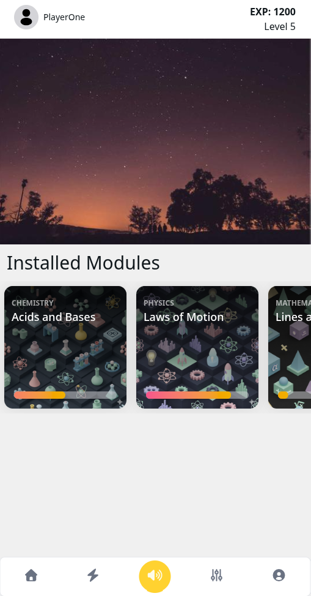

# GyanSetu Learner App

This is the front-end for the learner app of the GyanSetu project. It makes use of react, indexeddb and VitePWA to provide a hybrid webapp experience with offline-first support and modularity!

## Todo

- [x] Integrate HeroUI and Swiper
- [x] Implement VitePWA
- [ ] Add Integration for Cardboard VR
- [ ] Switch to ModuleAPI
- [ ] Add front-end for profile and settings
- [ ] Take a look at indexeddb and implement offline sync
- [ ] Host front-end and test PWA capabilities

## Screenshots



**Note:** PWA/Offline functionality requires SSL!

## QuickInstall

You would install this just like any other react project:

````bash
```bash
git clone git@github.com:gyansetu-app/learner-frontend.git
cd learner-frontend
npm install
```

For just testing out the front-end you can easily run the development server:

```bash
npm run dev
```

And this would start the development server at 0.0.0.0

> [!WARNING]
> This uses the `vite --host` option by default, so the webapp would be exposed to the entire local internet, be cautious!

## Testing PWA

PWA capabilities are not enabled by default, you would need to serve a production build first:

```bash
npm build
npm run serve
```

This would start the production server at 0.0.0.0:4173. You would then need to point it to a reverse proxy such as nginx and use an SSL certificate so that it uses the HTTPS protocol, only then would the PWA work even offline scenarios.
````
